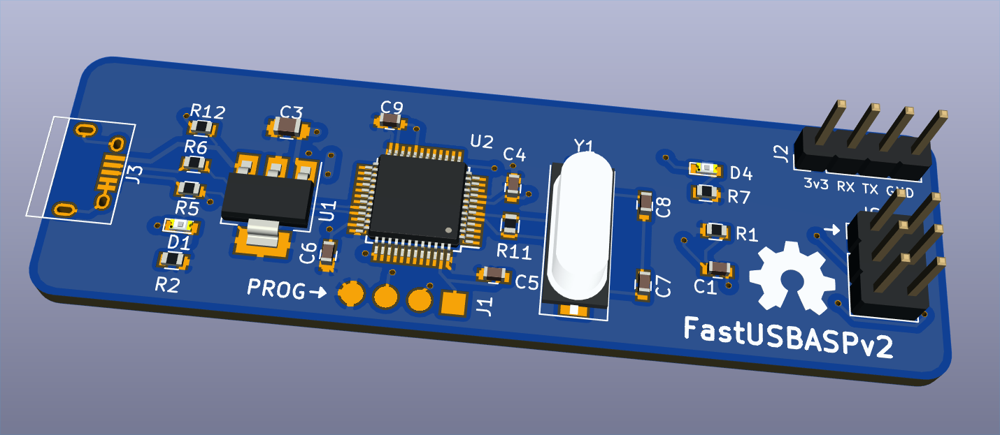

### FASTUSBasp programmer for AVR Microcontrollers
[](https://gitter.im/FASTUSBasp/Lobby?utm_source=badge&utm_medium=badge&utm_campaign=pr-badge&utm_content=badge)

This is the fast ISP programmer for AVR MCUs based on cheap stm32f103c8t6 aka `blue-pill` board with usb-to-serial support.

#### FastUSBASPv2 board


#### Perf board


### Correcting wrong pullup at USB D+

This blue pill board has wrong pullup resistor at usb D+ line.
You might need to fix it before using blue pill as an AVR programmer.
Refer to this guide: [http://amitesh-singh.github.io/stm32/2017/10/09/correcting-usbpullup-resistor.html][fixpullup-link]

### how to upload firmware

#### blue pill board with correct pullup at USB D+ line
If you have fixed the pullup at D+ line, use `firmware/fastusbasp.bin`
The pre-compiled binary is at `firmware/fastusbasp.bin`.

```shell
$ git clone https://github.com/amitesh-singh/FASTUSBasp
$ st-flash write firmware/fastusbasp.bin 0x08000000
```

#### blue pill board with wrong pullup at USB D+ line
In case, you did not fix the wrong pullup at D+ line, use  
`firmware/fastusbasp-wrongpullup.bin` binary instead

```shell
$ git clone https://github.com/amitesh-singh/FASTUSBasp
$ st-flash write firmware/fastusbasp-wrongpullup.bin 0x08000000
```


### How to use

#### ISP connections

It uses SPI2 to communicate to AVR.

Blue pill | AVR   
--------- | -------
PB15  |   MOSI  
PB14  |   MISO  
PB13  |   SCK    
PA8   |   RST  
5v or 3.3v |     5v   
GND        |    GND   

#### Serial connections
Serial ports are `PA10`(RX) and `PA9` (TX).  
This can be used to debug AVR Microcontrollers.

Blue pill | AVR   
--------- | -------
PA10      | TX
PA9       | RX

All pins SPI2(PB15, PB14, PB13), Serial(PA10, PA9) and RST(PA8) used are 5V tolerant.

#### udev rule

Refer to [udev/README.md](udev/README.md)

#### On plugging to PC
When you plug this device to PC, you should get following message on`dmesg -wH`

```shell
[Jan20 13:31] usb 3-1.1: new full-speed USB device number 5 using xhci_hcd
[  +0.107774] usb 3-1.1: New USB device found, idVendor=16c0, idProduct=05dc
[  +0.000004] usb 3-1.1: New USB device strings: Mfr=1, Product=2, SerialNumber=3
[  +0.000002] usb 3-1.1: Product: fastusbasp
[  +0.000002] usb 3-1.1: Manufacturer: http://amitesh-singh.github.io
[  +0.000001] usb 3-1.1: SerialNumber: AARAV
[  +0.040797] cdc_acm 3-1.1:1.0: ttyACM0: USB ACM device
[  +0.000804] usbcore: registered new interface driver cdc_acm
[  +0.000000] cdc_acm: USB Abstract Control Model driver for USB modems and ISDN adapters
```

`/dev/ttyACM0` is the serial port.

#### Probe AVR

```shell
$ avrdude -c usbasp-clone -p m16

avrdude: AVR device initialized and ready to accept instructions

Reading | ################################################## | 100% 0.00s

avrdude: Device signature = 0x1e9403 (probably m16)

avrdude: safemode: Fuses OK (E:FF, H:D8, L:CF)

avrdude done.  Thank you.
```

#### Upload program to AVR

```shell
$ avrdude -c usbasp-clone -p m16 -U flash:w:blink.hex

avrdude: AVR device initialized and ready to accept instructions

Reading | ################################################## | 100% 0.00s

avrdude: Device signature = 0x1e9403 (probably m16)
avrdude: NOTE: "flash" memory has been specified, an erase cycle will be performed
         To disable this feature, specify the -D option.
avrdude: erasing chip
avrdude: reading input file "blink.hex"
avrdude: input file blink.hex auto detected as Intel Hex
avrdude: writing flash (150 bytes):

Writing | ################################################## | 100% 0.02s

avrdude: 150 bytes of flash written
avrdude: verifying flash memory against blink.hex:
avrdude: load data flash data from input file blink.hex:
avrdude: input file blink.hex auto detected as Intel Hex
avrdude: input file blink.hex contains 150 bytes
avrdude: reading on-chip flash data:

Reading | ################################################## | 100% 0.01s

avrdude: verifying ...
avrdude: 150 bytes of flash verified

avrdude: safemode: Fuses OK (E:FF, H:D8, L:CF)

avrdude done.  Thank you.

```

#### Read flash
```shell
$ avrdude -c usbasp-clone -p m16 -U flash:r:flash.bin:r

avrdude: AVR device initialized and ready to accept instructions

Reading | ################################################## | 100% 0.00s

avrdude: Device signature = 0x1e9403 (probably m16)
avrdude: reading flash memory:

Reading | ################################################## | 100% 0.33s

avrdude: writing output file "flash.bin"

avrdude: safemode: Fuses OK (E:FF, H:D8, L:CF)

avrdude done.  Thank you.

$ hexdump flash.bin 
0000000 c029 0000 c02f 0000 c02d 0000 c02b 0000
0000010 c029 0000 c027 0000 c025 0000 c023 0000
0000020 c021 0000 c01f 0000 c01d 0000 c01b 0000
0000030 c019 0000 c017 0000 c015 0000 c013 0000
0000040 c011 0000 c00f 0000 c00d 0000 c00b 0000
0000050 c009 0000 2411 be1f e5cf e0d4 bfde bfcd
0000060 d002 c017 cfcd 9ab8 9ac0 ef2f ed83 e390
0000070 5021 4080 4090 f7e1 c000 0000 98c0 ef2f
0000080 ed83 e390 5021 4080 4090 f7e1 c000 0000
0000090 cfeb 94f8 cfff                         

```

#### Flash Read/Write speed

Flash Write speed: 15 KBps  
Flash Read Speed: 52.5 KBps

### Bit clock speed
`FASTUSBasp` starts out with a fast ISP clock frequency (default: 3 MHz),
   so the `-B bitclock` option might be required to achieve stable communication
in case target MCU `F_CPU` is bit low < 12MHz
#### Supported bitclock speed
 
- default (without -B): 3 MHz  
- 1.5 MHz  
- 750 KHz  
- 375 KHz  
- 187.5 KHz  


### how to compile from source and upload the firmware
To build fastusbasp firmware from source code, follow below guidelines.

#### compile
Refer my post on how to setup stm32 devlopment environment on Arch linux.
http://amitesh-singh.github.io/stm32/2017/04/09/setting-stm32-dev-environment-arch-linux.html

Make sure you have compiled `libopencm3` library.

```shell
$ git clone https://github.com/amitesh-singh/FASTUSBasp
$ vi config.cmake  # set the libopencm3 path here
$ cmake .
$ make
```
#### Upload the firmware
##### using STLINK
connect `st-link` programmer to `blue-pill` and upload the firmware

```shell
$ make fastusbasp-upload

```

##### using serial port

Install `stm32flash` utility on linux.
To program `stm32f103` via USART, you need to set `BOOT0` as `1`
and leave `BOOT1` as `0`.

Connect any usb to uart converter device and connect PA9 to RXD and PA10 to TXD
and connect GND.

```shell
$ make fastusbasp-serialupload

```

#### Links

- http://amitesh-singh.github.io/stm32/2017/05/21/FASTUSBasp-programmer-avr.html
- https://hackaday.io/project/21189-fastusbasp-programmer-for-avr

[fixpullup-link]: http://amitesh-singh.github.io/stm32/2017/10/09/correcting-usbpullup-resistor.html
